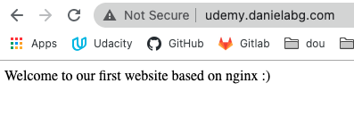

## some docker commands
The first instructions are to run a centos container, and inside install nginx.

But later I decided to rather run a VM with centos.

    docker run -dit -p 80:80 centos:8 /bin/bash

    docker exec -it <container id> bash

    yum -y install epel-release

    yum -y install nginx

This wouldn't be necessary in docker

Docker does not use systemctl, as its permissions mangament would be contradictory to the microservices approach. And, nginx is already started.

> systemctl status nginx

> service nginx status

## Some nginx stuff 
Main conf file
> vi /etc/nginx/nginx.conf

This will check the syntax of the conf file and output errors
> nginx -t 

WEB PAGE CONTENT
> cd /usr/share/nginx/html

If using the nginx container, this is how you reload it, instead of systemd
> docker exec <nginx-container-name-or-id> nginx -s reload

## Create our own website
create a new file in /etc/nginx/conf.d/

The main conf file includes all *.conf files that are here.
> kplabs.conf

At the end, instead of using that file I only replaced the root directive on the nginx.conf file.

        #root         /usr/share/nginx/html;
        root         /var/www/websites/;

backup the default conf files (it was on the course but I didn't do it)

        mv nginx.conf.default nginx.conf.default.bak
        ssl.conf (not found on centos8, the course uses centos6)
        virtual.conf (not found either)

create the websites directory

        mkdir -p /var/www/websites
        cd /var/www/websites
        touch index.html
        chmod 755 .

Disable selinux, for development. Before this I had 403 forbidden.

It is a state machine, first from enabled - permissive, then disabled.

This will set it to permissive.
> setenforce 0

Open the config file of selinux
> vi /etc/selinux/config

Modify from permissive to disabled
> SELINUX=disabled
Restart
> systemctl restart nginx

See errors here
> /var/log/nginx/error.log

Restart the service and visit the webpage
> systemctl restart nginx

